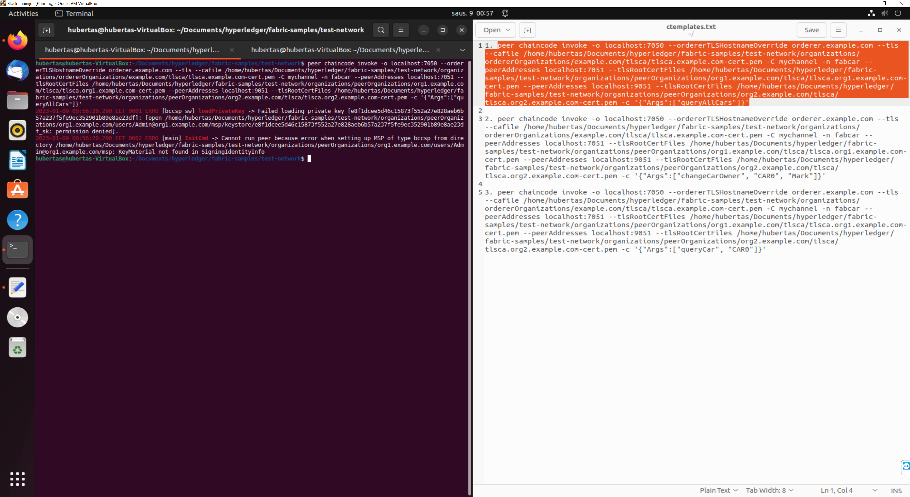

# 13 Paskaita

## Prerequisites

### 1. git --version


### 2. node --version


### 3. npm --version


### 4. docker --version


### 5. docker-compose --version

	Kadangi docker-compose versija yra 1.29.2, o skaidrėse 2.1.1, tai buvo nuspręsta paleisti (užtruko 15+min, nes viskas buvo outdated kaip reikalas)

	```console
	1. sudo apt update
	2. sudo apt upgrade
	```

### 6.  Fabric installation script


### 7. Changing Fabric installation script to executable file


### 8. Executing Fabric installation script (naudoju sudo, nes kitaip permision denied :( )


### 9. NPM install on chaincode/fabcar/javascript


### 10.  Running startFabric.sh with javascript 


#EDIT_1 running like this does not work, missing permissions so SUDO again

#EDIT_2 after running the previous command with sudo, we came up with another problem, so we install **jq** using **sudo apt install jq** to fix it :)


### 11. Removing wallets


### 12. Making sure docker is installed


### 13. Peer chaincode


### 14. Adding env variables


#EDIT_1 Giving permissions to folder (test-network) using sudo chmod 777 ./*


### 15. Running invokes

#EDIT_1 error after running first invoke so we use chmod 777 for the current folder.




### 16. Dashboard 


### 17. Final touches

